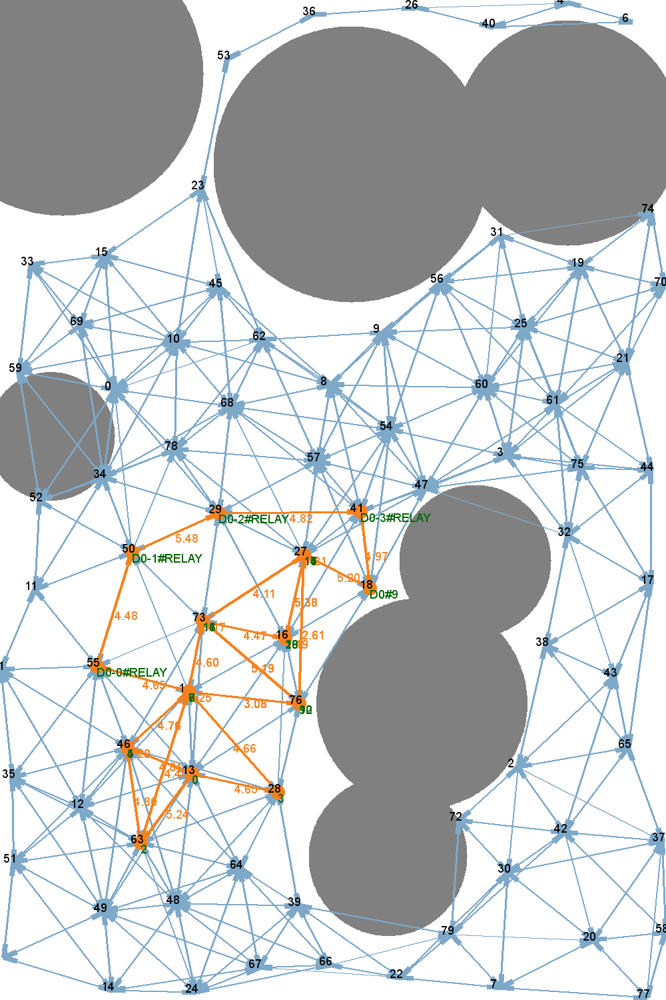

## Scheduling Algorithm by Task Splitting

Code release for the IEEE/MobileCloud '19 paper: Throughput Optimized Scheduler for Dispersed Computing Systems

Contact: Diyi Hu (`diyihu@usc.edu`)


### Overview

This repo implements the ideas for improving steady-state throughput of dispersed computing systems. The scheduling algorithm uses the technique of `task splitting` and `task duplication` to improve the performance of bottleneck stage in the execution pipeline. 

We provide a comprehensive simulator for the proposed scheduling algorithm. The simulator 1). Takes as input the configuration of the dispersed computing cluster and the task DAG, 2). Generate random clusters and tasks based on the user configuration, and 3). Outputs the steady-state throughput by scheduling the DAG with the proposed algorithm. 

Citation:

```
@INPROCEEDINGS {dispersed_scheduler,
author = {Diyi Hu and Bhaskar Krishnamachari},
booktitle = {2019 7th IEEE International Conference on Mobile Cloud Computing, Services, and Engineering (MobileCloud)},
title = {Throughput Optimized Scheduler for Dispersed Computing Systems},
year = {2019},
volume = {},
issn = {},
pages = {76-84},
keywords = {task analysis;throughput;cloud computing;bandwidth;pipelines;scheduling algorithms;performance evaluation},
doi = {10.1109/MobileCloud.2019.00018},
url = {https://doi.ieeecomputersociety.org/10.1109/MobileCloud.2019.00018},
publisher = {IEEE Computer Society},
address = {Los Alamitos, CA, USA},
month = {apr}
}
```

### File Structure

Regarding dispersed computing cluster:
* `config_cluster/`: Configuration of the dispersed computing cluster. You can specify parameters such as number of compute nodes, communication bandwidth, amount of obstacles, etc. See `config_cluster/example.yml` for details in parameters
* `gen_proc_graph.py`: The script to generate dispersed computing processor graphs. This script keeps generating random graphs until we find one conforming to the user configuration specified in `config_cluster/`. 
  * See `plots/example_cluster.png` for a random cluster generated by the script


Regarding task DAG:
* `config_task/`: Configuration of the task DAG. You can specify the topological property of the task DAG, and the computation-communication patterns such as CCR. See `config_task/example.yml` for details in parameters
* `rand_task_gen.py`: The script to generate random task DAG. This script keeps generating random DAGs until we find one conforming to the user configuration specified in `config_task/`. 
  * See `plots/example_task.png` for a random task generated by the script


Scheduling algorithms:
* `scheduler.py`: the main script. You can see the end-to-end simulator results by executing this script. See

```
python scheduler.py -h
```

for the available command line arguments

Run:

```
python scheduler.py --task_path input1.tgff --cluster_yaml config_cluster/example.yml --num_run 10 --task_yaml config_task/example.yml
```

as an example for generating scheduling results. 

* `scheduler_general.py`: the base scheduler class
* `scheduler_dup.py`: the sub-class of the base scheduler class, implementing task duplication
* `scheduler_split.py`: the sub-class of the base scheduler class, implementing task splitting
* See `plots/example_schedule.png` for an example scheduling after "task splitting" and "task dup" by our algorithm

